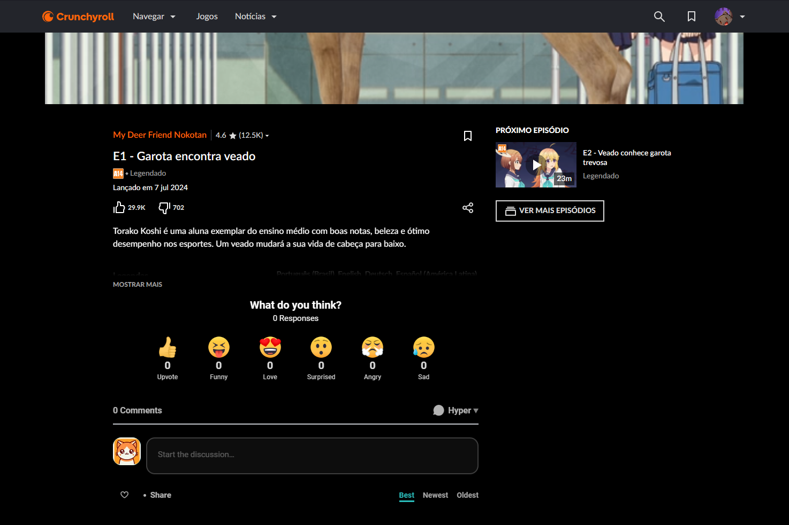
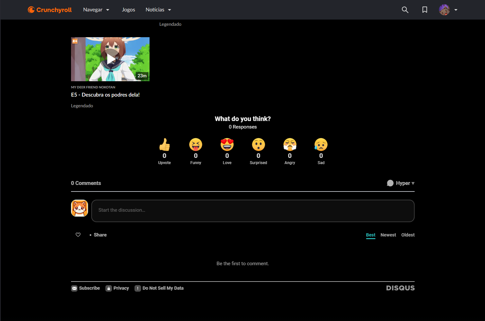

<div align="center">


# CRComments
</div>

CRComments is a browser extension that integrates Disqus comments into Crunchyroll, allowing users to discuss their favorite anime directly on the site. This extension is designed to enhance the user experience by providing a community space for feedback and discussion.

## Table of Contents


- [Features](#features) ✨
- [Supported Languages](#supported-languages) 🌍
- [Installation](#installation) 💻
- [Usage](#usage) 🛠️
- [Customization](#customization) ⚙️
- [Screenshots](#screenshots) 📸
- [Troubleshooting](#troubleshooting) 🛠️
- [Development](#development) 🛠️
- [Contributing](#contributing) 🤝
- [License](#license) 📜
- [Project Status](#project-status) 📈
- [Acknowledgments](#acknowledgments) 🙏
- [Contact](#contact) 📧
- [FAQ](#faq) ❓

## Features

- Adds a Disqus comment section below the video player on Crunchyroll.
- Provides a welcome overlay with introductory information.
- Allows users to customize comment settings such as language and sort order.
- Features a loading spinner while Disqus is initializing.

## Supported Languages

- English
- Spanish
- French
- German
- Japanese
- Korean
- Chinese
- Russian
- Portuguese (European)
- Portuguese (Brazilian)
- Italian
- Dutch

## Installation

### For Developers

1. Clone this repository to your local machine:

    ```sh
    git clone https://github.com/hypegg/CRComments.git
    cd crunchyroll-disqus-comments
    ```

2. Load the extension in your browser:

   - **Google Chrome**:
     1. Open Chrome and navigate to `chrome://extensions/`.
     2. Enable "Developer mode" using the toggle.
     3. Click "Load unpacked" and select the directory where you cloned the repository.

   - **Mozilla Firefox**:
     1. Open Firefox and navigate to `about:debugging`.
     2. Click "This Firefox" (or "This Nightly" if using Firefox Nightly).
     3. Click "Load Temporary Add-on" and select the `manifest.json` file from the directory where you cloned the repository.

### For Users

It's not available yet, due to the stores' approval process. But you can install it manually using the developer mode explained above.

## Usage

- Once installed, the extension will automatically add a Disqus comment section on some Crunchyroll pages.
- You can customize your settings by visiting the options page (`chrome://extensions/` > "CRComments" > "Options").

## Customization

- **Language**: Choose your preferred language from the options menu.
- **Sort Order**: Select how you want comments to be sorted (Best, Newest, or Oldest).

## Screenshots




## Troubleshooting

- **Disqus comments not appearing**: Ensure that you have a stable internet connection and that Disqus is not blocked by any ad blockers.
- **Extension not loading**: Try reloading the extension or restarting your browser. Make sure you are using the latest version of the extension.

## Development

- To contribute or modify the extension, clone the repository and follow the installation steps for developers.
- Make your changes and test locally before committing and pushing to GitHub.

## Contributing

1. Fork the repository on GitHub.
2. Create a new branch (`git checkout -b feature/YourFeature`).
3. Commit your changes (`git commit -am 'Add new feature'`).
4. Push to the branch (`git push origin feature/YourFeature`).
5. Create a new Pull Request on GitHub.

## License

This project is licensed under the [MIT License](LICENSE). See the [LICENSE](LICENSE) file for details.

## Project Status

This project is currently in active development. We welcome contributions and feedback to improve the extension.

## Acknowledgments

- Disqus for providing a powerful commenting platform.
- Crunchyroll for the anime content.

## Contact

For any issues or questions, please open an issue on the [GitHub repository](https://github.com/hypegg/CRComments/issues) or contact me directly on GitHub: [hypegg](https://github.com/hypegg).

## FAQ

**Q: How do I report a bug or request a feature?**  
A: Please open an issue on the [GitHub repository](https://github.com/hypegg/CRComments/issues) with detailed information.

**Q: Can I contribute to the translation of the extension?**  
A: Yes, contributions for additional languages are welcome. Please refer to the [contributing guidelines](CONTRIBUTING.md) for more information.
